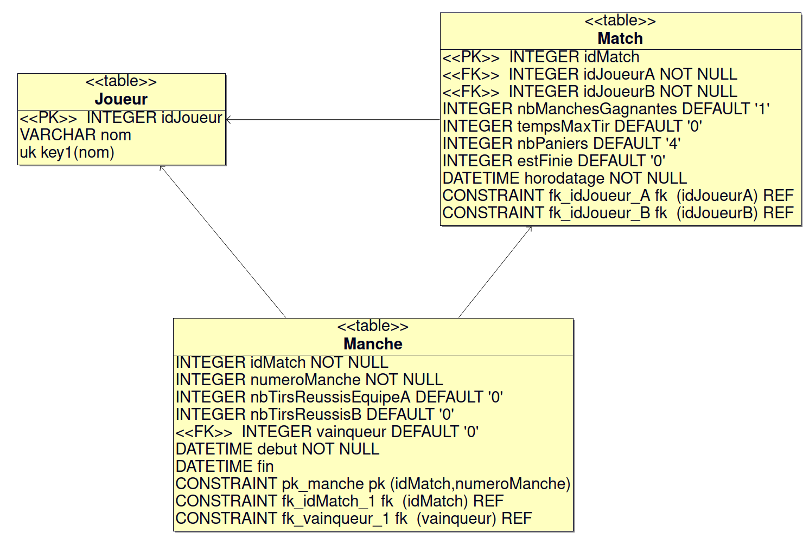
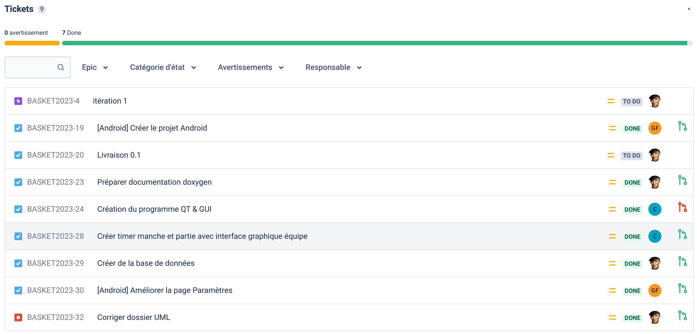
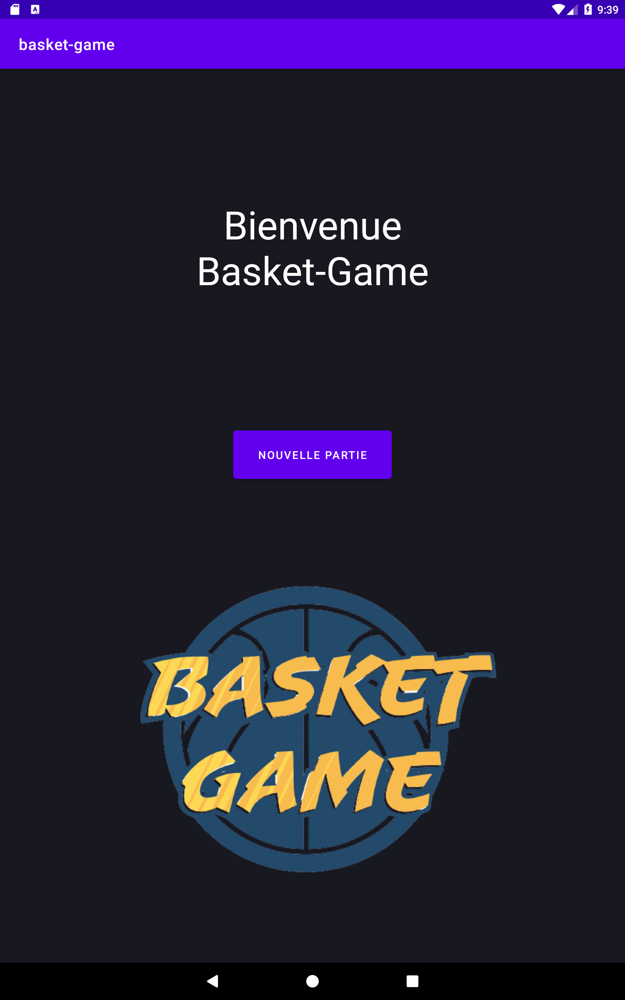
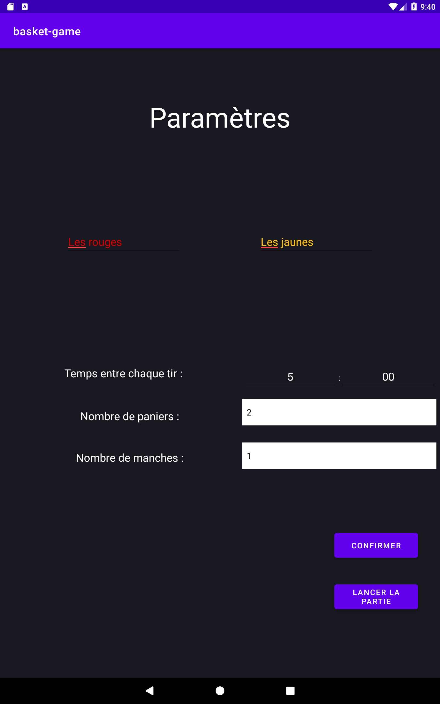
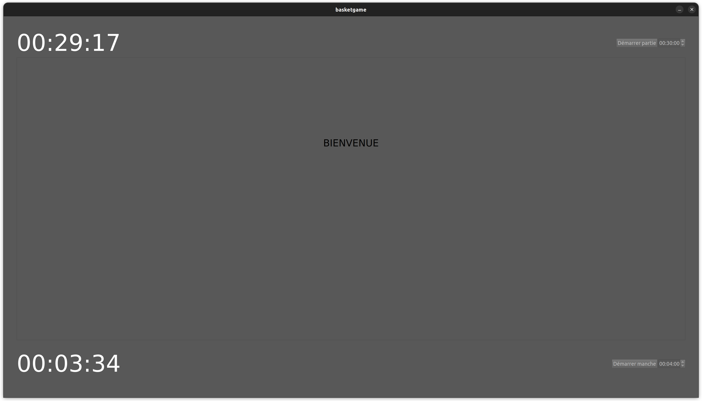

 

 [](https://github.com/btssn-lasalle-84/basket-game-2023/actions/workflows/make-qt.yml) [](https://github.com/btssn-lasalle-84/basket-game-2023/actions/workflows/android-build.yml) [](https://github.com/btssn-lasalle-84/basket-game-2023/actions/workflows/pages/pages-build-deployment)

# Le projet basket-game 2023

- [Le projet basket-game 2023](#le-projet-basket-game-2023)
  - [Documentation du code](#documentation-du-code)
  - [Base de données](#base-de-données)
  - [Versions](#versions)
    - [0.1](#01)
  - [Auteurs](#auteurs)

---

Basket Game est un système numérique dédié à la phase d'entraînement au panier de Basket-ball afin d'ajouter un aspect ludique et esprit de compétition. Il propose de reproduire le jeu Puissance 4 (© Hasbro) en alignant plusieurs paniers de basket, chacun représentant une colonne du jeu. Deux équipes (ou 2 joueurs) lancent le ballon à tour de rôle. Chaque panier correspond à 1 jeton dans le jeu, de la couleur de l’équipe. Les équipes devront donc envoyer le ballon dans le bon panier afin de créer l’alignement de jetons, tout en bloquant l’adversaire. Un écran affichera la partie en cours.

- Module de détection des paniers (EC)
- Module de signalisation (EC)​
- Module de gestion de partie (Android - IR)​
- Module de visualisation de partie (Qt - Raspberry Pi - Écran télévision - IR)​

## Documentation du code

https://btssn-lasalle-84.github.io/basket-game-2023/

## Base de données

Base de données SQLite :



```sql
-- Supprime les tables

DROP TABLE IF EXISTS Manche;
DROP TABLE IF EXISTS Match;
DROP TABLE IF EXISTS Joueur;

-- Création des tables

-- Table Joueur

CREATE TABLE IF NOT EXISTS Joueur(idJoueur INTEGER PRIMARY KEY AUTOINCREMENT, nom VARCHAR, UNIQUE(nom));

-- Table Match

CREATE TABLE IF NOT EXISTS Match(idMatch INTEGER PRIMARY KEY AUTOINCREMENT, idJoueurA INTEGER NOT NULL, idJoueurB INTEGER NOT NULL, nbManchesGagnantes INTEGER DEFAULT 1, tempsMaxTir INTEGER DEFAULT 0, nbPaniers INTEGER DEFAULT 4, estFinie INTEGER DEFAULT 0, horodatage DATETIME NOT NULL, CONSTRAINT fk_idJoueur_A FOREIGN KEY (idJoueurA) REFERENCES Joueur(idJoueur), CONSTRAINT fk_idJoueur_B FOREIGN KEY (idJoueurB) REFERENCES Joueur(idJoueur));

-- Table Manche

CREATE TABLE IF NOT EXISTS Manche(idMatch INTEGER NOT NULL, numeroManche INTEGER NOT NULL, nbTirsReussisEquipeA INTEGER DEFAULT 0, nbTirsReussisEquipeB INTEGER DEFAULT 0, vainqueur INTEGER DEFAULT 0, debut DATETIME NOT NULL, fin DATETIME, CONSTRAINT pk_manche PRIMARY KEY (idMatch,numeroManche), CONSTRAINT fk_idMatch_1 FOREIGN KEY (idMatch) REFERENCES Match(idMatch), CONSTRAINT fk_vainqueur_1 FOREIGN KEY (vainqueur) REFERENCES Joueur(idJoueur));
```

## Versions

### 0.1



- Android :





- Qt :



## Auteurs

- Étudiant IR : Nathanael CHANSARD
- Étudiant IR : Florent GUILLAUMET

---
©️ LaSalle Avignon 2023
