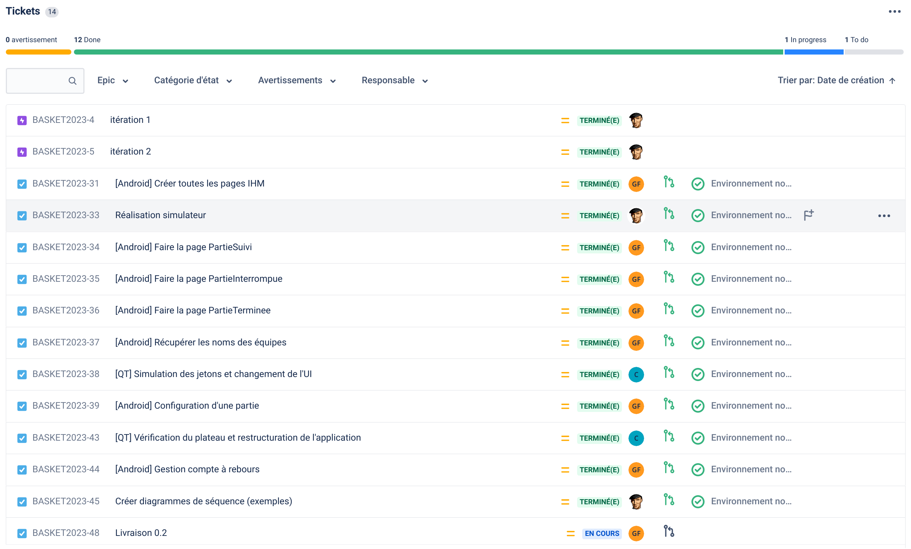

 

   

# Le projet basket-game 2023

- [Le projet basket-game 2023](#le-projet-basket-game-2023)
  - [Documentation du code](#documentation-du-code)
  - [Versions](#versions)
    - [0.1](#01)
    - [0.2](#02)
  - [Affichage](#affichage)
  - [Auteurs](#auteurs)

---

Basket Game est un système numérique dédié à la phase d'entraînement au panier de Basket-ball afin d'ajouter un aspect ludique et esprit de compétition. Il propose de reproduire le jeu Puissance 4 (© Hasbro) en alignant plusieurs paniers de basket, chacun représentant une colonne du jeu. Deux équipes (ou 2 joueurs) lancent le ballon à tour de rôle. Chaque panier correspond à 1 jeton dans le jeu, de la couleur de l’équipe. Les équipes devront donc envoyer le ballon dans le bon panier afin de créer l’alignement de jetons, tout en bloquant l’adversaire. Un écran affichera la partie en cours.

- Module de détection des paniers (EC)
- Module de signalisation (EC)​
- Module de gestion de partie (Android - IR)​
- Module de visualisation de partie (Qt - Raspberry Pi - Écran télévision - IR)​

## Documentation du code

https://btssn-lasalle-84.github.io/basket-game-2023/

## Versions

### 0.1

### 0.2

## Affichage 

- Android :

- Qt :

## Auteurs

- Étudiant IR : Nathanael CHANSARD <chansardnathanael@gmail.com>
- Étudiant IR : Florent GUILLAUMET <florent.guillaumet.pro@gmail.com>

---
©️ LaSalle Avignon 2023
